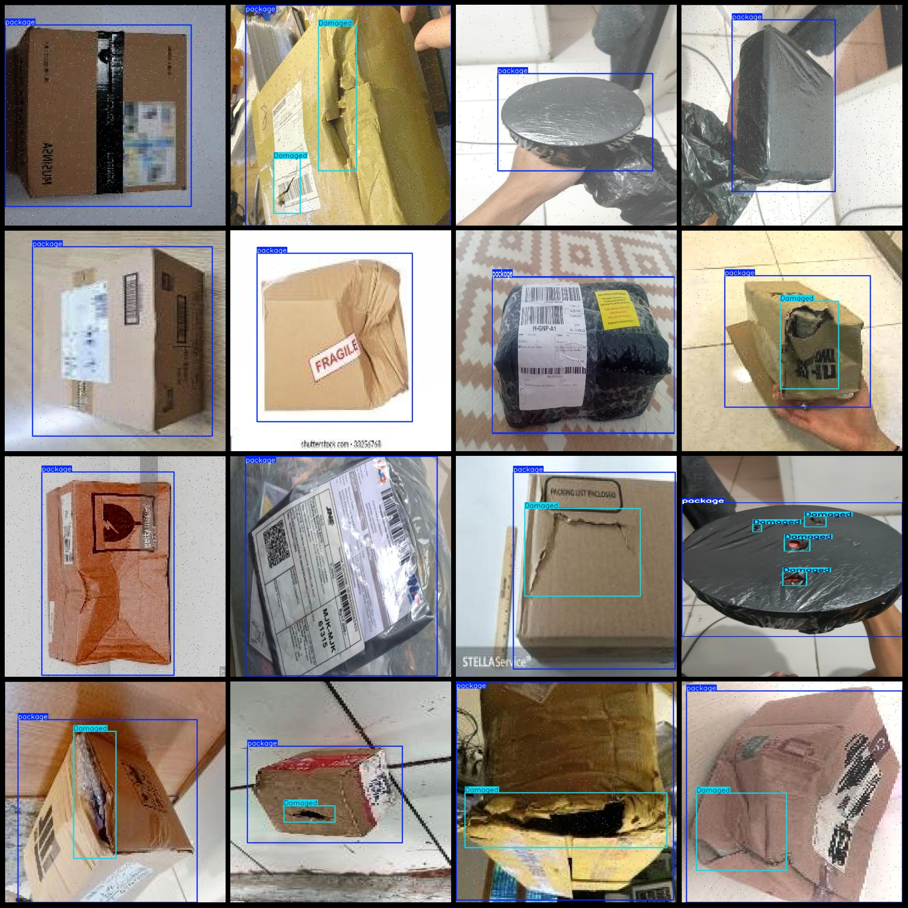
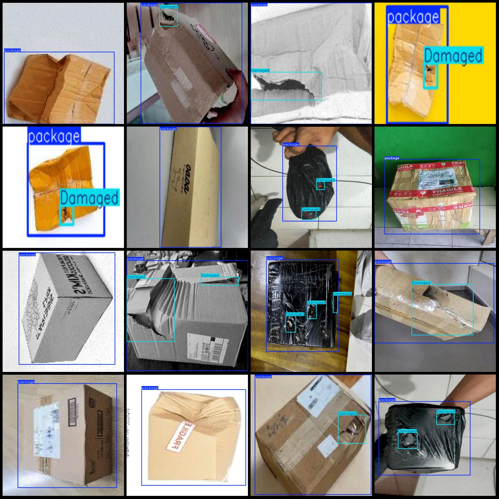

# Wisdom Logistics Express Parcel Damage Detection Dataset VOC+YOLO Format with 1340 Images

Please note that approximately 500 images are original, while the remaining 840 are enhanced images. Please refer to the image previews for details.

The dataset is formatted as Pascal VOC format + YOLO format (excluding the segmentation path in the txt file, only including JPG images along with their respective VOC format xml files and YOLO 
format txt files).

Number of images (JPG files): 1340
Number of annotations (xml files): 1340
Number of annotations (txt files): 1340
Number of annotation categories: 2
Annotation category names (note that the order of labels in the YOLO format may not correspond to this, but is based on the "labels" folder's "classes.txt"): ["Damaged", "package"]
Box count for each category:
Damaged boxes = 1290
Package boxes = 1348
Total boxes = 2638
Number of images per category:
Damaged images = 798
Package images = 1340
Image resolutions: Includes multi-resolution images, such as 150x200, 640x640, etc.
Annotation tool used: labelImg
Annotation rules applied: Drawing bounding box around the category.
Important note: The dataset does not include a training/validation/test split; users must manually divide the data.
Special declaration: This dataset does not guarantee any accuracy in the trained models or weights files.

Image Preview:
Annotation Example:

## Image

Here is a pay link on Stripe ( https://buy.stripe.com/3cs8yP7sY87d0vu9AB ). Please contact me lonlonago@foxmail.com after funding $89, and I will send you a complete data files , thank you!

